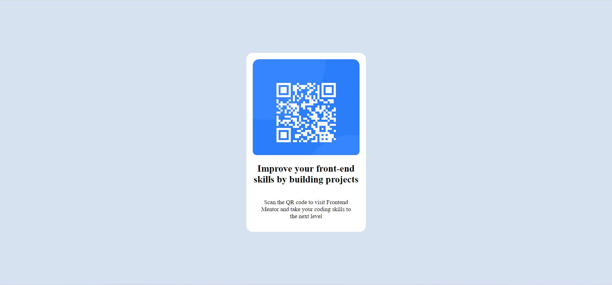

# Frontend Mentor - QR code component solution

This is a solution to the [QR code component challenge on Frontend Mentor](https://www.frontendmentor.io/challenges/qr-code-component-iux_sIO_H). Frontend Mentor challenges help you improve your coding skills by building realistic projects. 

## Table of contents

- [Overview](#overview)
  - [Screenshot](#screenshot)
  - [Links](#links)
- [My process](#my-process)
  - [Built with](#built-with)
  - [What I learned](#what-i-learned)
  - [Continued development](#continued-development)
  - [Useful resources](#useful-resources)
- [Author](#author)
- [Acknowledgments](#acknowledgments)

## Overview

### Screenshot

### Links

- Solution URL: https://qr-code-scanner-tau.vercel.app/
- Live Site URL: https://qr-code-scanner-tau.vercel.app/

## My process

### Built with

- Semantic HTML5 markup
- CSS custom properties
- Flexbox
- CSS Grid
- Mobile-first workflow
### What I learned

This project showed me how to create a template with a card and how to arrange them in the webpage.

### Continued development

This project let me focus on the new fields where I can use to develope more projects lie this.

### Useful resources

- [W3 schools](https://www.w3schools.com) - This helped me for to understand the new styles to be used to take my project forward.

## Author

- Website - [Veera Anjaneyulu](https://qr-code-scanner-tau.vercel.app/)
- Frontend Mentor - [@Devil-Hacker2](https://www.frontendmentor.io/profile/Devil-Hacker2)

